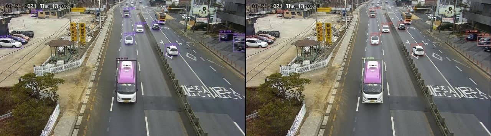

# license_plate_de-identification
This is the easiest way to de-identify license plates.

## Method
1. Using pretrained yolo4 model, find car, truck, bus and train. (In my test video, the pretrained yolo model sometimes predicts truck as train.)
2. Blur the lower part of the bounding box to de-identify the license plate. 

(If you want to see the result of this method, click the below image. It will leads you to the result video on YouTube.)

3. Even if the license plate is de-identified in this way, it does not have a significant effect on learning or referencing by deep learning.

* [Left image] After blurring the license plate using the proposed method, the result of the yolo model inference.
* [Right image] Using the original video, the result of the yolo model inference.

##  Run

0. Requirements:
    * Install python3.
    * Install opencv-python.
    * Install cvlib.
    * Install [tensorflow](https://www.tensorflow.org/install/).
1. Testing:
    * Run `python main.py --input [input_video_file_path] --output [output_video_file_path]`.
2. Still have questions?
    * If you still have questions (e.g.: How filelist looks like? How to use multi-gpus? How to do batch testing?), please first search over closed issues. 

If the problem is not solved, please open a new issue.
